# Mô tả Dự án RS-Management

## I. NGHIỆP VỤ

### 1. Tóm lược điều hành
RS-Management là hệ thống quản lý bán hàng và kho hàng hợp nhất cho chuỗi cửa hàng/bán lẻ. Giải quyết toàn trình từ quản lý sản phẩm – tồn kho theo lô (batch) – đơn bán – khuyến mãi/voucher – khách hàng – báo cáo. Hệ thống hướng tới vận hành chuẩn, kiểm soát tồn kho chặt chẽ, giảm thất thoát, tăng tốc bán hàng và ra quyết định dựa trên dữ liệu.

### 2. Mục tiêu dự án
- Tối ưu vận hành bán hàng tại điểm bán và theo chuỗi cửa hàng.
- Quản lý tồn kho chi tiết theo lô hàng, hạn dùng, trạng thái.
- Tăng doanh số qua khuyến mãi có kiểm soát, quản lý voucher và khách hàng.
- Cung cấp báo cáo/dashboards thời gian thực cho quản lý cửa hàng và vùng.
- Đảm bảo phân quyền rõ ràng, truy vết và an toàn dữ liệu.

### 3. Phạm vi nghiệp vụ
- Quản lý danh mục: sản phẩm, danh mục, nhà cung cấp, cửa hàng.
- Quản lý kho: lô hàng nhập, tồn kho theo lô tại từng cửa hàng, điều chỉnh tồn, chuyển kho.
- Bán hàng: đơn bán, dòng hàng, phân bổ hàng từ lô, thanh toán, hóa đơn.
- Khuyến mãi: voucher, phát hành cho khách hàng, đối soát sử dụng.
- Khách hàng: thông tin, điểm tích lũy.
- Người dùng & phân quyền: tài khoản, vai trò, quyền hạn theo cửa hàng.
- Báo cáo: doanh thu, tồn kho, hiệu quả bán hàng theo sản phẩm/cửa hàng/(ngày|tuần|tháng).

### 4. Đối tượng sử dụng
- Quản lý chuỗi/giám sát vùng: theo dõi doanh thu, tồn kho, hiệu quả.
- Quản lý cửa hàng: vận hành nhập – bán – chuyển kho – trả hàng – điều chỉnh tồn.
- Thu ngân/nhân viên bán hàng: tạo đơn, áp dụng voucher, xử lý thanh toán.
- Kho/thu mua: nhập lô hàng, phân bổ về cửa hàng, điều chỉnh và kiểm kê.
- Bộ phận marketing/CSKH: phát hành voucher, theo dõi hiệu quả.

### 5. Các phân hệ chính
- Quản lý sản phẩm
  - Sản phẩm, SKU, giá bán, danh mục.
- Quản lý lô hàng (Batch) và tồn kho theo lô (Batch Stock)
  - Theo dõi số lượng gốc, giá nhập, ngày sản xuất – hạn dùng – ngày về hàng.
  - Trạng thái tồn kho theo lô tại từng cửa hàng: ACTIVE/EXPIRED/DAMAGED/RESERVED/SOLD_OUT.
- Quản lý cửa hàng, vị trí
- Nhà cung cấp
- Bán hàng (Sales)
  - Đơn bán, dòng hàng, phân bổ tồn lô (allocation), phương thức thanh toán.
- Khách hàng
  - Thông tin, giới tính, điểm tích lũy.
- Khuyến mãi/Voucher
  - Phát hành, giới hạn theo thời gian, số lượng, theo khách hàng; đối soát sử dụng.
- Chuyển kho giữa cửa hàng
  - Phiếu chuyển, chi tiết lô, trạng thái.
- Điều chỉnh tồn kho
  - Tăng/giảm tồn theo nguyên nhân: hỏng, mất, kiểm kê.
- Người dùng – Vai trò – Quyền
  - SYSADMIN/ADMIN/STAFF; gán người dùng vào cửa hàng; quyền chi tiết theo chức năng.
- Dashboard & Báo cáo
  - Tổng hợp doanh thu, số đơn, tồn kho hiện tại, hiệu quả theo sản phẩm/cửa hàng.

### 6. Quy trình nhiệp vụ trọng yếu

- Quy trình bán hàng
  - Tạo đơn → Xác thực khuyến mãi/voucher → Phân bổ hàng từ các lô còn khả dụng → Cập nhật tồn kho theo lô → Hoàn tất thanh toán → Ghi nhận doanh thu.
- Nhập hàng và phân bổ
  - Nhập lô từ nhà cung cấp → Tạo batch → Phân bổ batch đến các cửa hàng → Theo dõi tồn khả dụng và hết hạn sớm nhất.
- Chuyển kho
  - Tạo yêu cầu chuyển → Xác nhận xuất từ cửa hàng nguồn → Nhập tại cửa hàng nhận → Cập nhật tồn theo lô.
- Trả hàng (sale return)
  - Gắn với đơn bán gốc, xác định dòng hàng trả, nhập lại hàng (nếu đạt điều kiện), hoàn tiền theo phương thức quy định.
- Điều chỉnh tồn
  - Thực hiện khi kiểm kê/hao hụt/hỏng → ghi nhận lý do, tham chiếu chứng từ.
- Quản lý khuyến mãi
  - Cấu hình voucher (theo % hoặc giá trị), thời gian hiệu lực, đối tượng, giới hạn sử dụng → phát hành → áp dụng vào đơn bán → đối soát giá trị giảm trừ.

### 7. Mô hình dữ liệu chính

- Sản phẩm: **product** liên kết **category**, giá bán, SKU duy nhất.
- Lô hàng: **batch** (giá nhập, NSX, HSD, nhà cung cấp) → **batch_stock** tại từng cửa hàng (tồn tổng, tồn khả dụng, đặt chỗ, trạng thái).
- Bán hàng: **sale_order** (cửa hàng, KH, voucher, phương thức thanh toán, giá cuối) → **sale_line** (sản phẩm, số lượng, đơn giá) → **sale_allocation** (phân bổ lô & giá vốn chụp tại thời điểm).
- Khách hàng: **customer** (điểm tích lũy).
- Khuyến mãi: **voucher**, **voucher_customer**, **voucher_redemption**.
- Kho & vận hành: **inventory_adjustment**, **store_transfer**, **store_transfer_item**.
- Người dùng & phân quyền: **users**, **role**, **permission**, **user_role**.
### 8. Một số quy tắc nghiệp vụ

- Giá trị dương và hợp lệ:
  - Giá bán/giá nhập > 0; thành tiền đơn hàng ≥ 0.
  - Số lượng đặt/được cấp/picked không âm; picked ≤ allocated ≤ ordered.
- Tính hợp lệ theo thời gian:
  - Lô hàng: HSD > NSX; ngày về ≥ NSX.
  - Voucher: còn hiệu lực trong khoảng thời gian cấu hình.
- Quản lý tồn kho theo lô:
  - Tồn khả dụng không âm, không vượt tồn tổng; tự động chuyển trạng thái SOLD_OUT khi hết hàng.
- Giới hạn voucher:
  - Theo tổng số phát hành, theo từng khách hàng; có đối soát mỗi lần áp dụng.
- Phân quyền:
  - Quyền theo vai trò và theo cửa hàng; mọi thao tác đều có trường truy vết người tạo/cập nhật/xóa mềm.
### 9. Sơ đồ hệ thống

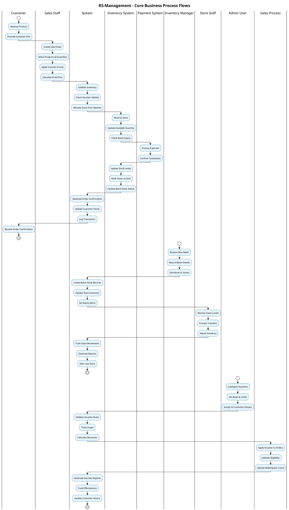

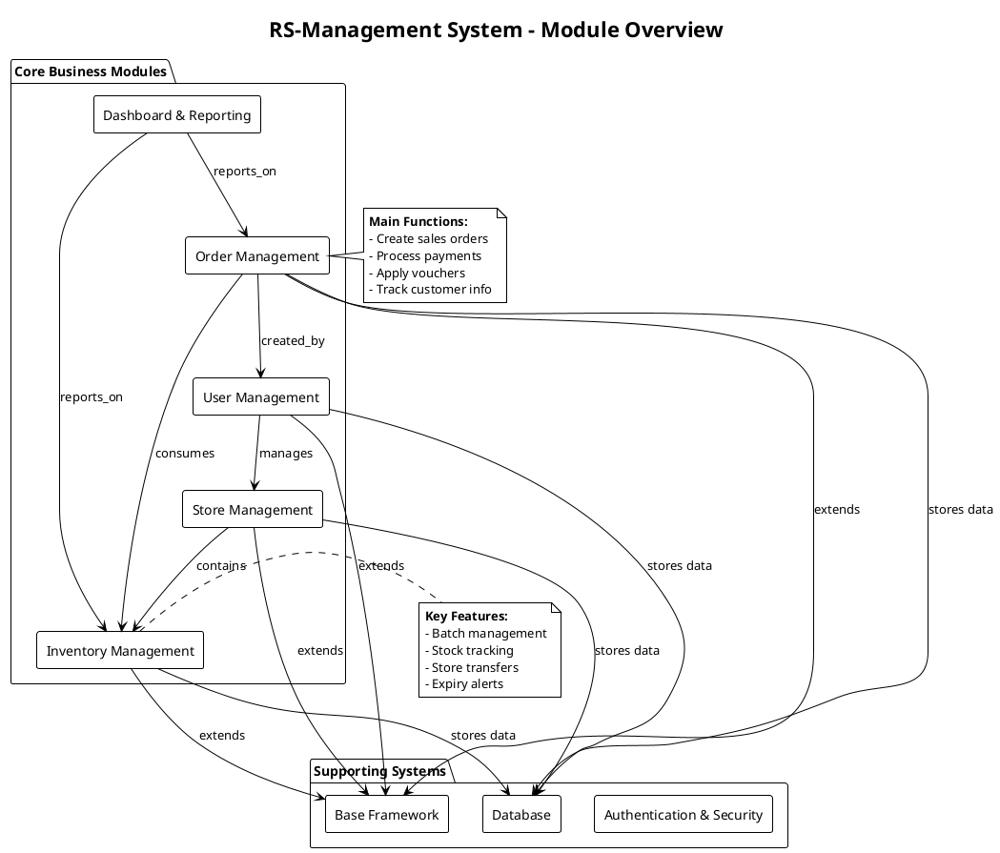

## II. CHUYÊN MÔN

### 1. Mô hình layer


- Web Layer (Presentation Layer):


Lớp này có nhiệm vụ chính giao tiếp với người dùng. Nó gồm các thành phần giao diện (api, web form…) và thực hiện các công việc như nhập liệu, hiển thị dữ liệu, kiểm tra tính đúng đắn dữ liệu trước khi gọi lớp Business Logic Layer (BLL).


- Service Layer (Business Logic Layer):


Đây là nơi đáp ứng các yêu cầu thao tác dữ liệu của GUI layer, xử lý chính nguồn dữ liệu từ Presentation Layer trước khi truyền xuống Data Access Layer và lưu xuống hệ quản trị CSDL.

Đây còn là nơi kiểm tra các ràng buộc, tính toàn vẹn và hợp lệ dữ liệu, thực hiện tính toán và xử lý các yêu cầu nghiệp vụ, trước khi trả kết quả về Presentation Layer.


- Repository Layer (Data Access Layer):

  Lớp này có chức năng giao tiếp với hệ quản trị CSDL như thực hiện các công việc liên quan đến lưu trữ và truy vấn dữ liệu ( tìm kiếm, thêm, xóa, sửa,…).

### 2. Base

#### 2.1 Persistence

##### 2.1.1 Entity

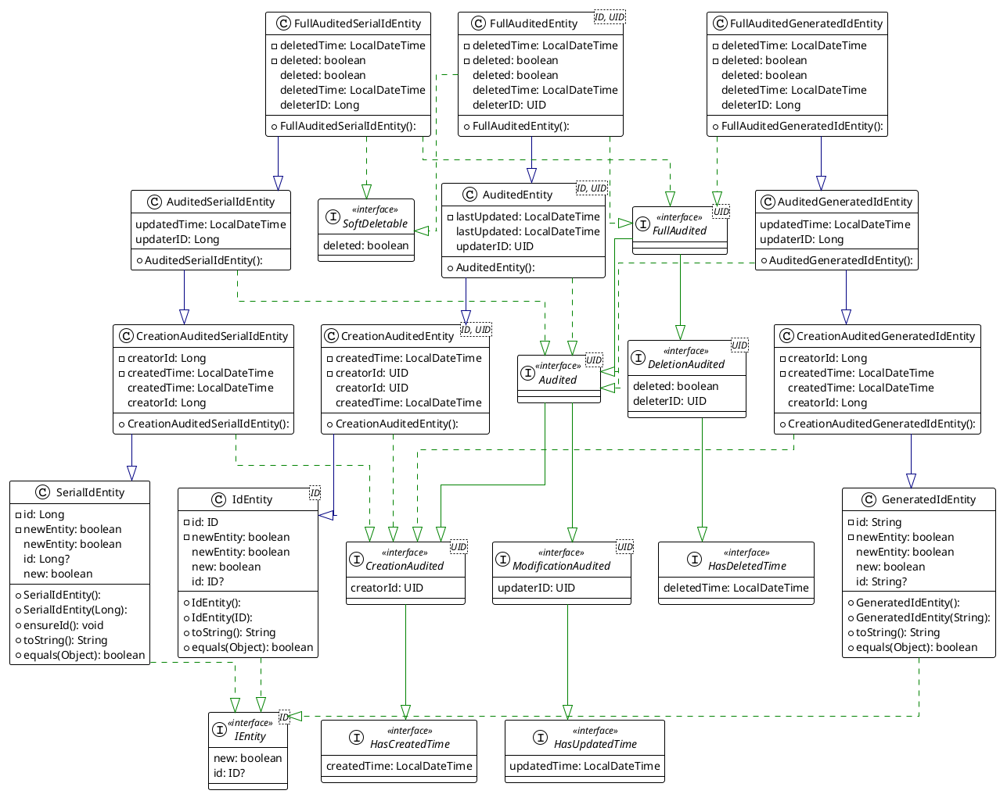

- IEntity<ID extends Serializable> là interface cha đại diện cho tất cả các model.

- SerialIdEntity là abstract class implements IEntity đại diện cho các model có ID kiểu số.

- GeneratedIdEntity là abstract class implements IEntity đại diện cho các model có ID kiểu chuỗi.

- HasCreatedTime là interface được implements khi model cần có thông tin về thời gian tạo.

- HasUpdatedTime là interface được implements khi model cần có thông tin về thời gian chỉnh sửa.

- HasDeletedTime là interface được implements khi model cần có thông tin về thời gian xóa.

- SoftDeltetable là interface đượ implements khi model muốn có khả năng xóa mềm.

- CreationAudited, ModificationAudited, DeletionAudited là các interface lần lượt extends 3 interfaces tương ứng ở trên nhưng có thêm thông tin về ID của người thực hiện,dùng khi model cần có thông tin về người thực hiện các thao tác thêm, sửa, xóa.

- Audited<UID> là interface extends CreationAudited<UID> và ModificationAudited<UID> đại diện cho các thông tin audit cơ bản của một model như thời gian tạo, ai tạo, thời gian sửa, ai sửa. Các model muốn có các thông tin audit cơ bản cần implements interface này.

- FullAudited<UID> là interface extends Audited<UID> đại diện cho thông tin audit đầy đủ của một model: thời gian tạo, người tạo, thời giản sửa, người sửa, thời gian xóa, người xóa.

- Class AuditedEntity<ID extends Serializable, UID extends Serializable> sẽ cài đặt các phương thức từ interface Audited<UID> và khóa chính ID trong model này sẽ là kiểu dữ liệu là tùy ý mặc định tức là khóa chính sẽ không được auto set thì có nghĩa là người dùng phải nhập tay hoặc theo phương thức nào đó.

- Class CreationAuditedGeneratedIdEntity extends GeneratedIdEntity sẽ cài đặt các phương thức từ interface CreationAudited<Long> ở đây thì kiểu dữ liệu của ID sẽ được gán cứng là String. Và ID sẽ không được hibernate tự động generate ra mà do hệ thống tự động random ra UUID.random.toString() và set vào ID.Trong model này sẽ có thêm các trường là "created_at", ”created_by”, các trường này tương ứng với việc ai tạo, tạo khi nào.

- Class CreationAuditedSerialIdEntity sẽ cài đặt các phương thức từ interface CreationAudited<Long> ở đây kiểu dữ liệu sẽ được gán cứng là long. Id kiểu SnowFlake được sinh tự động bằng một SnowFlakeIdGenerator trước khi lưu vào database. Trong model này sẽ có thêm các trường là "created_at", ”created_by”, các trường này tương ứng với việc ai tạo, tạo khi nào.

- 2 Class là AuditedSerialIdEntity và AuditedGeneratedIdEntity đều implements Audited<UID>. Việc implements class này model sẽ có thêm các trường “updated_at”, “updated_by” tương ứng với ai sửa, sửa khi nào.

- Class AuditableDbEntry<ID extends Serializable> sẽ kế thừa từ class BaseDbEntry<ID> và cài đặt các phương thức từ AuditableEntity<ID>. Trong model này sẽ có thêm các trường là "created_time", ”created_id”, ”last_updated_time”, ”last_updated_id”, các trường này tương ứng với việc ai tạo, tạo khi nào, ai sửa, sửa khi nào.

- Class FullAuditedSerialIdEntity kế thừa AuditedSerialIdEntity và cài đặt các method từ 2 interface FullAudited<UID> và SoftDeletable. Tức là model này sẽ có cả trường id (kiểu SnowFlake) và “created_at”, “created_by”, “updated_at”, “updated_by” từ lớp cha, ngoài ra còn có thêm các trường “deleted”, “deleted_at” ,”deleted_by” tương ứng với đã xóa chưa, xóa khi nào, xóa bởi ai.

- Class FullAuditedGeneratedIdEntity kế thừa AuditedSerialIdEntity và cài đặt các method từ 2 interface FullAudited<UID> và SoftDeletable. Tức là model này sẽ có cả trường id (kiểu UUID v4) và “created_at”, “created_by”, “updated_at”, “updated_by” từ lớp cha, ngoài ra còn có thêm các trường “deleted”, “deleted_at” ,”deleted_by” tương ứng với đã xóa chưa, xóa khi nào, xóa bởi ai.

##### 2.1.2 Repository

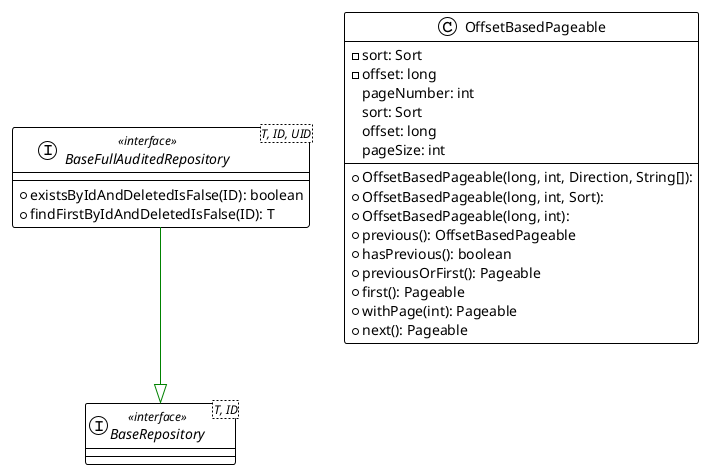

- Interface BaseRepository<T extends IEntity<ID>, ID extends Serializable> sẽ kế thừa từ interface JpaRepository<T, ID>, QuerydslPredicateExecutor<T> sẽ có các phương thức CRUD built-in, và  QuerydslPredicateExecutor sẽ cung cấp tùy chọn cho câu query dynamic hơn và có thể reusable.

- Interface BaseFullAuditedRepository<T extends IEntity<ID> & FullAudited<UID>, ID extends Serializable, UID extends Serializable> sẽ kế thừa BaseRepository<T, ID>. Ngoài các phương thức ở BaseRepository sẽ có thêm các phương thức:

    - findFirstByIdAndDeletedIsFalse(ID id): lấy một dữ liệu theo id chưa bị chuyển trạng thái xóa (deleted==false)

    - existsByIdAndDeletedIsFalse(ID id): kiểm tra có tồn tại đối tượng theo id mà chưa bị chuyển trạng thái xóa

- Class OffsetBasedPageable cài đặt các phương thức từ interface Pageable sẽ custom lại phân trang theo kiểu offset limit.

#### 2.2 Service

##### 2.2.1 Dto

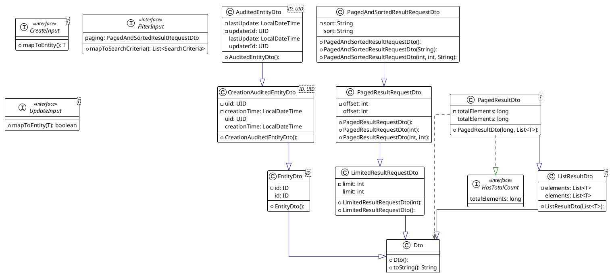

Controller nhận DTO > Service chuyển DTO thành model hoặc entity, rồi xử lý > Repository nhận Entity đưa vào DB.

- Class Dto sẽ là Class cha của các dto. Trong class có method toString() sẽ chuyển đổi sang chuỗi Json

  Class EntityDto<ID extends Serializable> sẽ kế thừa Dto và có thêm trường ID dùng để tạo các class Dto có thông tin về ID.

- Class ListResultDto<T> kế thừa Dto chứa method trả về 1 danh dách các model.

  Class LimitedResultRequestDto kế thừa Dto dùng để đặt và thay đổi số lượng kết quả trả về trong 1 lần gọi API.

- Class PagedResultRequestDto kế thừa LimitedResultRequestDto để thêm và sửa thông tin về số thứ tự của trang dữ liệu hiện tại.

  Class PagedAndSortedResultRequestDto kế thừa PagedResultRequestDto để thêm và sửa thông tin về các trường dữ liệu được sắp xếp. Hoặc có thể truyền là PagedAndSortedResultRequestDto (int offset, int limit, String sort)

- Ex. PagedAndSortedResultRequestDto (0, 50, “+id”) → lấy ra page 0 với 50 item và sort theo id ASC
  Pattern là: (+)column1,(-)column2,…

  	Có thể sort theo nhiều field PagedAndSortedResultRequestDto(0, 50, “+id,-name,”)

HasTotalCount là interface được implements cho các custom class để phân trang chứa thông tin tổng số bản ghi.

- Class PagedResultDto kế thừa ListResultDto<T> và triển khai interface HasTotalCount sẽ chứa thông tin về số lượng bản ghi và dữ liệu về các bản ghi.

  Interface CreateInput<T extends Serializable> là class đại diện cho dữ liệu được thêm mới.Method mapToEntity(): T (Các class implements cần triển khai method này với mục đích convert từ Dto model sang Entity model)  .

- Interface UpdateInput<T extends Serializable> là class đại diện cho dự liệu dùng để update của 1 model. Method mapToEntity(): boolean (Mục đích là khi dữ liệu cần cập nhật có sự thay đổi so với dữ liệu trong entity ở một điểm nào đó thì xác nhận hành vi cập nhật đó, nếu không có sự khác biệt thì sẽ không cập nhật).

##### 2.2.2 Filter

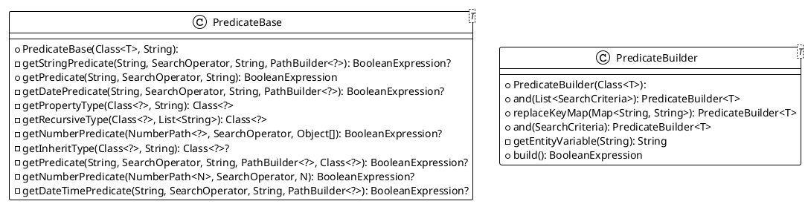

- Dynamic Query Builder bao gồm hai class chính được thiết kế để xây dựng các truy vấn động sử dụng QueryDSL, cho phép tạo ra các điều kiện tìm kiếm phức tạp một cách linh hoạt và type-safe.

- PredicateBase là class core chịu trách nhiệm tạo ra các boolean expressions từ các tiêu chí tìm kiếm đơn lẻ. Class này xử lý việc mapping từ search criteria sang QueryDSL predicates.

- Hỗ trợ đa dạng kiểu dữ liệu

    - Số học: Integer, Long, Double với các operator như EQUALS, GREATER_THAN, LESS_THAN, BETWEEN

    - Boolean: Chỉ hỗ trợ operator EQUALS

    - String: Hỗ trợ EQUALS (ignore case) và CONTAINS (ignore case)

    - Thời gian: LocalDate và LocalDateTime với đầy đủ comparison operators

    - Multi-value: Hỗ trợ multiple values được phân tách bằng dấu gạch dưới (_)


- Class PredicateBase có method chính:

  public BooleanExpression getPredicate(String key, SearchOperator operator, String value).

Class<?> getInheritType(Class<?> clazz, String property) hỗ trợ tìm kiếm trường trong cây gia phả  của class đó.

- Class PredicateBuilder<T> là class builder pattern cho phép tạo ra các complex queries bằng cách kết hợp nhiều search criteria với nhau.

  Sử dụng method chaining để tạo ra cú pháp dễ đọc và dễ sử dụng:
  ex:
  ```dsl
  PredicateBuilder<User> builder = new PredicateBuilder<>(User.class)
  .and(new SearchCriteria("name", SearchOperator.CONTAINS, "John"))
  .and(new SearchCriteria("age", SearchOperator.GREATER_THAN, "18"));
  ```

- Cho phép mapping key names để thay đổi field names trong query:
  ex:
  ```dsl
  Map<String, String> keyMap = Map.of("userName", "user.name");
  builder.replaceKeyMap(keyMap);
  ```

- Các method chính:
    - and(SearchCriteria criteria)
      ->Thêm một điều kiện tìm kiếm vào builder
    - and(List<SearchCriteria> criterias)
      ->Thêm nhiều điều kiện tìm kiếm cùng lúc
    - replaceKeyMap(Map<String, String> replaceKeyMap)
      ->Thiết lập mapping cho field names
    - build()
      ->Tạo ra BooleanExpression cuối cùng từ tất cả criteria đã được thêm vào.


##### 2.2.3 Service logic

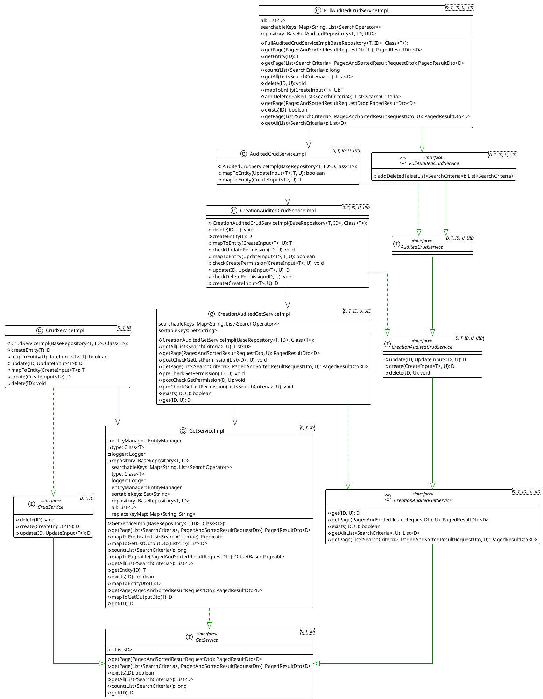

- Interface GetService<D, T, ID> chứa các method:

    - getPage(PagedAndSortedResultRequestDto) : PagedResultDto<D> (trả về 1 trang dữ liệu theo yêu cầu phân trang).

    - getPage(List<SearchCriteria>, PagedAndSortedResultRequestDto) : PagedResultDto<D> (trả về một trang dữ liệu theo yêu cầu phân trang, dữ liệu được lọc thỏa mãn với danh sách các điều kiện truyền vào).

    - get(ID) : D (tìm kiếm 1 model theo ID của nó, trả về Dto của model đó)

    - exists(ID) : boolean (kiểm tra xem có tồn tại bản ghi có ID được truyền vào không).

    - count(List<SearchCriteria>) : long (trả về số lượng bản ghi thỏa mãn điều kiện được truyền vào).

    - getAll(List<SearchCriteria>): List<D> (trả về 1 danh sách Dto mà model của nó thỏa mãn điều kiện truyền vào).

- Class GetServiceImpl<D, T, ID> implements interface GetService và triển khai các method của nó. Ngoài ra có thêm các method:

    - mapToEntityDto(T) : D (để map dữ liệu từ 1 model sang Dto của nó). Method này là abstract và các class extends GetServiceImpl cần triển kahi method này.

    - mapToGetOutputDto(T) : D (để map dữ liệu từ 1 model sang Dto trả về của nó).

    - mapToGetListOutputDto(List<T>) : List<D> (để map từ 1 danh sách các model thành Dto của các model đó và trả về 1 danh sách các Dto)

    - getSortableKeys() : Set<String> (để sửa và lấy ra danh sách các trường – key được phép sắp xếp của một model nào đó. Mặc định class GetServiceImpl đã thêm key “id” vào danh sách các trươnngf được phép sắp xếp của các model mà service của nó extends GetServiceImpl, nếu muốn chỉnh sửa như thêm bớt các trường cần sắp xếp, các service cụ thể đó cần overide lại method này).

    - getSearchableKeys() : Map<String, List<SearchOperator>> (để sửa và lấy ra danh sách các trường – key được phép tìm kiếm và các toán tử tìm kiếm được phép trên trường-key đó của một model nào đó. Mặc định class GetServiceImpl đã thêm key “id” và toán tử EQUALS vào danh sách các trường được phép tìm kiếm của các model mà service của nó extends GetServiceImpl, nếu muốn chỉnh sửa như thêm bớt các trường và toán tử được phép sử dụng khi cần tìm kiếm, các service cụ thể đó cần overide lại method này).

    - mapToPageable(PagedAndSortedResultRequestDto) : OffsetBasedPageable (method này sẽ parse và xử lý dữ liệu của 1 PagedAndSortedResultRequestDt truyền vào như phân tích yêu cầu sắp xếp.. và trả về một OffsetBasedPageable đã chuẩn hóa).

    - mapToPredicate(List<SearchCriteria>) : Predicate (dùng để parse danh sách các điều kiện (SearchCriteria) truyền vào thành 1 Predicate để QuerydslExecutor hiểu và thực thi truy vấn).

- Class CreationAuditedGetServiceImpl<D, T, ID, U, UID> implements interface CreationAuditedGetService và kế thừa GetServiceImpl có thêm các method pre và post check với thao tác lấy dữ liệu (get) để kiểm tra quyền,…

- Interface CreationAuditedGetService<D, T, ID, U, UID> kế thừa GetService và với mỗi method yêu cầu truyền thêm một Dto của User class để lưu vết thông tin của người thao tác trên dữ liệu.

- Class CreationAuditedCrudServiceImpl<D, T, ID, U, UID> implements CreationAuditedCrudService và kế thừa CreationAuditedGetServiceImpl và triển khai đầy đủ các method pre-post checking, create, update, delete, mapToEntity.

- Interface CreationAuditedCrudService<D, T, ID, U, UID> có các method create, update, delete cơ bản cùng với thông tin về người thực hiện

- Interface AuditedCrud	Service<D, T, ID, U, UID> extends từ CreationAuditedCrudService<D, T, ID, U, UID>

- Interface CrudService<D, T, ID> kế thừa từ GetService và có thêm các method thêm sửa xóa trên dữ liệu:

    - create(CreateInput<T>) : D (phương thức tạo mới một model, yếu cầu truyền vào 1 Dto có kiểu CreateInput và trả về một Dto sau khi tạo mới thành công).

    - update(ID, UpdateInput<T>) : D (phương thức cập nhật thông tin của một model, yêu cầu truyền vào ID của model và một Dto kiểu UpdateInput<T> chứa thông tin cần cập nhật trên model tương ứng. Trả về Dto của model sau khi đã cập nhật thành công).

    - delete(ID) : void (phương thức để xóa mềm (soft delete) một bản ghi, yêu cầu truyền vào ID của model tương ứng).

- Class AuditedCrudServiceImpl<D, T, ID, U, UID> kế thừa CreationAuditedCrudServiceImp có đủ các method post-pre checking, create, update, delete, getAll,… với thông tin người thực hiện thao tác, implements interface AuditedCrudService.

- Interface FullAuditedCrudService<D, T, ID, U, UID> kế thừa AuditedCrudService và yêu cầu triển khai thêm abstract method addDeleteFalse() với các class implements nó.

- Class FullAuditedCrudServiceImpl<D, T, ID, U, UID> implements interface DullAuditedCrudService có đầy đủ các method exists(), create(), update(), delete(), maoToEntity(),… Ngoài ra còn triển khai method addDeleteFalse() -> mục đích chỉ thực hiện thao tác trên các bản ghi chưa bị xóa mềm (soft delete), tức là lọc các bản ghi chưa bị xóa trước khi thực hiện thao tác chính trên dữ liệu.

#### 2.3 Api

##### 2.3.1 Request

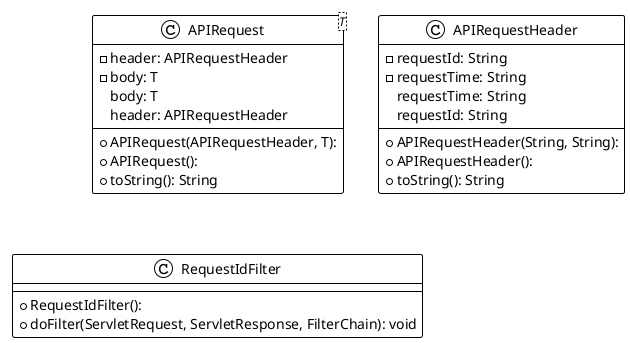

- Class APIRequestHeader: chứa các thông tin về header của một request gồm requestId, requestTime.

- Class APIRequest<T extends Serializable>: gồm 2 field là header: APIRequestHeader và body: T

##### 2.3.2 Response

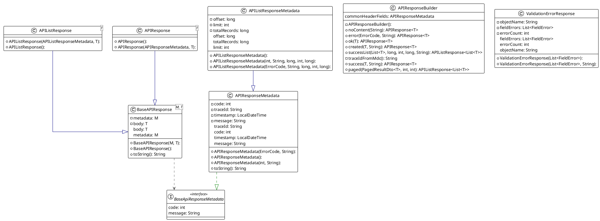

- Cấu trúc của response:
```postman
  {

    "metadata": {

        "timestamp": "2025-08-21T02:12:12.395978",

        "code": 200,

        "message": "OK",

        "traceId": "2491c596-2971-4b4b-adc8-efad0837ec95",

        "offset": 0, //when paging

        "limit": 20, //when paging

        "totalRecords": 1 //when paging

    },

    "body": [

        {

		//body here

        }

    ]

}
```

- Interface BaseAPIResponseHeader là nơi chứa các method chung như get set code và get set message.

- Class APIResponseHeader sẽ cài đặt các method từ interface  BaseAPIResponseHeader và có thêm field timestamp-> thời gian khi response

- Class BaseAPIResponse<H extends BaseAPIResponseHeader, T>: là class wrapper các object trả về (cụ thể là wrapper dối tượng dto response)  chứa header: H và body: T.

- Class APIResponse<T> kế thừa từ Class BaseAPIResponse<APIResponseHeader, T>: kèm sẵn header thuộc dạng đơn (là ko kèm offset limit và totalRecords)

- Class APIListResponse<T> kế thừa từ class BaseAPIResponse<APIListResponseHeader, T>: kèm sẵn header thuộc dạng list (là kèm offset limit và totalRecords)

##### 2.3.3 Controller

- Class GetController<D, T, ID> có các method triển khai kèm HTTP method để lấy dữ liệu danh sách các bản ghi, lấy danh sách các bản ghi theo điều kiện, lấy ra 1 bản ghi theo ID

- Class CrudController<D, T, ID, C,U> kế thừa GetController và có thêm các method để tạo mới, sửa, xóa bản ghi

- Class AuditedGetController<D, T, ID, User, UID> có các method để lấy dữ liệu sanh sách các bảng ghi ,danh sách các bản ghi theo điều kiện, lấy ra một bản ghi. Khác vơi GetController, các phươn thức này cần có thêm thông tin về user thực hiện thao tác.

- Class AuditedCrudController<D, T, ID, User, UID, C, U>  kế thừa AuditedGetController và có thêm các method tạo mới, sửa , xóa bản ghi.

#### 2.4 Exception

```plantuml
@startuml

!theme plain
top to bottom direction
skinparam linetype polyline

class AppAuthenticationException {
  + AppAuthenticationException(): 
  + AppAuthenticationException(List<FieldError>, String, Object[]): 
  + AppAuthenticationException(List<FieldError>): 
  + AppAuthenticationException(String, Object[]): 
  + AppAuthenticationException(String): 
  + AppAuthenticationException(List<FieldError>, String): 
  + AppAuthenticationException(Throwable): 
  + AppAuthenticationException(List<FieldError>, Throwable): 
  + AppAuthenticationException(String, Throwable): 
  + AppAuthenticationException(List<FieldError>, String, Throwable): 
}
class AppException {
  + AppException(List<FieldError>): 
  + AppException(String): 
  + AppException(String, Throwable): 
  + AppException(Throwable): 
  + AppException(List<FieldError>, Throwable): 
  + AppException(List<FieldError>, String): 
  + AppException(String, Object[]): 
  + AppException(): 
  + AppException(List<FieldError>, String, Object[]): 
  + AppException(List<FieldError>, String, Throwable): 
  - fieldErrors: List<FieldError>
   fieldErrors: List<FieldError>
}
class AppPersistenceException {
  + AppPersistenceException(): 
  + AppPersistenceException(String, Throwable): 
  + AppPersistenceException(String): 
  + AppPersistenceException(Throwable): 
  + AppPersistenceException(String, Object[]): 
}
class BlankIdentifierException {
  + BlankIdentifierException(): 
  + BlankIdentifierException(String, Throwable): 
  + BlankIdentifierException(String): 
  + BlankIdentifierException(String, Object[]): 
  + BlankIdentifierException(Throwable): 
}
class DuplicateIdentifierException {
  + DuplicateIdentifierException(String): 
  + DuplicateIdentifierException(Throwable): 
  + DuplicateIdentifierException(): 
  + DuplicateIdentifierException(String, Object[]): 
  + DuplicateIdentifierException(String, Throwable): 
}
class IllegalPropertyException {
  + IllegalPropertyException(String, Throwable): 
  + IllegalPropertyException(Throwable): 
  + IllegalPropertyException(String): 
  + IllegalPropertyException(List<FieldError>, String): 
  + IllegalPropertyException(List<FieldError>, String, Throwable): 
  + IllegalPropertyException(List<FieldError>, String, Object[]): 
  + IllegalPropertyException(List<FieldError>, Throwable): 
  + IllegalPropertyException(List<FieldError>): 
  + IllegalPropertyException(String, Object[]): 
  + IllegalPropertyException(): 
}
class InvalidFormatException {
  + InvalidFormatException(String, Throwable): 
  + InvalidFormatException(Throwable): 
  + InvalidFormatException(): 
  + InvalidFormatException(String): 
  + InvalidFormatException(String, Object[]): 
}
class MissingRequiredPropertyException {
  + MissingRequiredPropertyException(List<FieldError>, String, Throwable): 
  + MissingRequiredPropertyException(String, Throwable): 
  + MissingRequiredPropertyException(List<FieldError>): 
  + MissingRequiredPropertyException(): 
  + MissingRequiredPropertyException(List<FieldError>, String): 
  + MissingRequiredPropertyException(Throwable): 
  + MissingRequiredPropertyException(List<FieldError>, Throwable): 
  + MissingRequiredPropertyException(String, Object[]): 
  + MissingRequiredPropertyException(List<FieldError>, String, Object[]): 
  + MissingRequiredPropertyException(String): 
}
class ObjectNotFoundException {
  + ObjectNotFoundException(): 
  + ObjectNotFoundException(String, Object[]): 
  + ObjectNotFoundException(String): 
  + ObjectNotFoundException(String, Throwable): 
}

AppAuthenticationException        -[#000082,plain]-^  AppException                     
AppPersistenceException           -[#000082,plain]-^  AppException                     
IllegalPropertyException          -[#000082,plain]-^  AppException                     
InvalidFormatException            -[#000082,plain]-^  AppException                     
MissingRequiredPropertyException  -[#000082,plain]-^  AppException                     
ObjectNotFoundException           -[#000082,plain]-^  AppException                     
@enduml

```

#### 2.5 Util

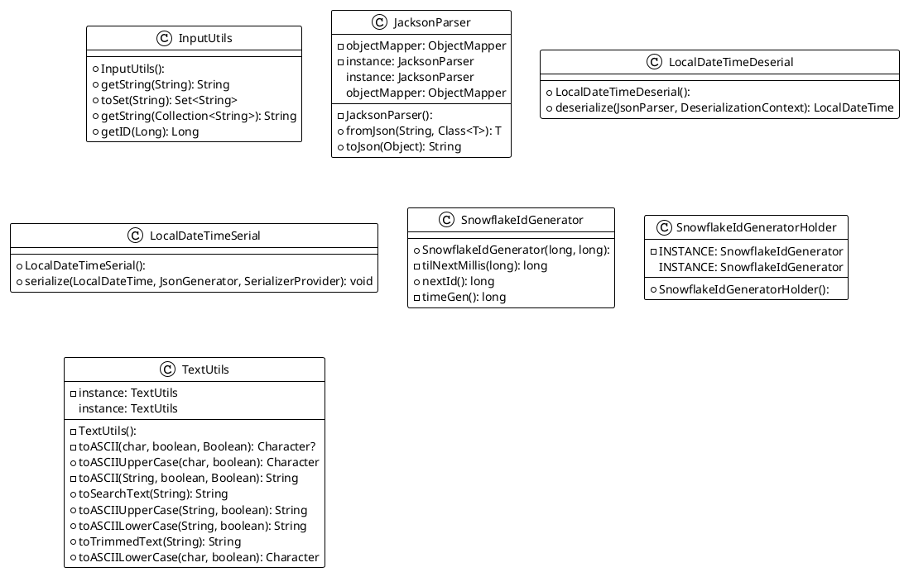

- Class JacksonParser sẽ dùng để parse các object thành kiểu Json.

- Class SnowFalkeIdGenerator có các method để sinh ID kiểu SnowFlake (ex: 123456789101112)

- Class TextUtil có các public method sau:

    - Character toASCIIUpperCase(char ch, boolean removeDisallowedSymbols): viết hoa toàn bộ và trả về Character

    - String toASCIIUpperCase(String input, boolean removeDisallowedSymbols): Viết hoa toàn bộ và trả về String

    - Character toASCIILowerCase(char ch, boolean removeDisallowedSymbols): viết thường toàn bộ và trả về Character

    - String toASCIILowerCase(String input, boolean removeDisallowedSymbols): viết thường toàn bộ và trả về String

      Parameter trong các method trên là removeDisallowedSymbols: if true thì nếu trong chuỗi truyền vào chứa các ký tự không cho phép thì sẽ xóa đi ngược lại thì sẽ giữ nguyên.

      Ex:

          toASCIIUpperCase(“Bac ^&* Nguyen”,true) → BAC NGUYEN

          toASCIIUpperCase(“Bac ^&* Nguyen”,false) → BAC ^&* NGUYEN

### 3.Core

#### 3.1 Database Schema
```sql

create table if not exists public.flyway_schema_history
(
    installed_rank integer                 not null
        constraint flyway_schema_history_pk
            primary key,
    version        varchar(50),
    description    varchar(200)            not null,
    type           varchar(20)             not null,
    script         varchar(1000)           not null,
    checksum       integer,
    installed_by   varchar(100)            not null,
    installed_on   timestamp default now() not null,
    execution_time integer                 not null,
    success        boolean                 not null
);

alter table public.flyway_schema_history
    owner to postgres;

create index if not exists flyway_schema_history_s_idx
    on public.flyway_schema_history (success);

create table if not exists public.category
(
    id         bigint generated by default as identity
        primary key,
    name       varchar(50) not null,
    "desc"     varchar(255),
    created_at timestamp   not null,
    created_by bigint      not null,
    updated_at timestamp   not null,
    updated_by bigint      not null,
    deleted    boolean     not null
);

alter table public.category
    owner to postgres;

create table if not exists public.product
(
    id          bigint generated by default as identity
        primary key,
    name        varchar(50) not null,
    sku         varchar(50) not null
        unique,
    "desc"      varchar(255),
    unit_price  integer     not null
        constraint chk_product_price_positive
            check (unit_price > 0),
    category_id bigint      not null
        references public.category,
    created_at  timestamp   not null,
    created_by  bigint      not null,
    updated_at  timestamp   not null,
    updated_by  bigint      not null,
    deleted     boolean     not null
);

alter table public.product
    owner to postgres;

create index if not exists idx_product_name_active
    on public.product (name)
    where (deleted = false);

create index if not exists idx_product_sku_active
    on public.product (sku)
    where (deleted = false);

create index if not exists idx_product_category_active
    on public.product (category_id)
    where (deleted = false);

create index if not exists idx_product_category_name
    on public.product (category_id, name)
    where (deleted = false);

create table if not exists public.customer
(
    id         bigint generated by default as identity
        primary key,
    name       varchar(20) not null,
    phone      varchar(15) not null,
    point      integer     not null
        constraint chk_customer_point_valid
            check (point >= 0),
    gender     char        not null,
    created_at timestamp   not null,
    created_by bigint      not null,
    updated_at timestamp   not null,
    updated_by bigint      not null,
    deleted    boolean     not null
);

alter table public.customer
    owner to postgres;

create index if not exists idx_customer_phone_active
    on public.customer (phone)
    where (deleted = false);

create index if not exists idx_customer_name_active
    on public.customer (name)
    where (deleted = false);

create index if not exists idx_customer_point_desc
    on public.customer (point desc)
    where (deleted = false);

create table if not exists public.voucher
(
    id                 bigint generated by default as identity
        primary key,
    code               varchar(50)                                  not null
        unique,
    "desc"             varchar(255),
    discount_per       smallint    default 0,
    discount_val       integer,
    valid_from         timestamp                                    not null,
    valid_to           timestamp                                    not null,
    qty_total          integer,
    qty_redeemed       integer     default 0                        not null,
    per_customer_limit smallint    default 1                        not null,
    audience_type      varchar(20) default 'ALL'::character varying not null,
    created_at         timestamp                                    not null,
    created_by         bigint                                       not null,
    updated_at         timestamp                                    not null,
    updated_by         bigint                                       not null,
    deleted            boolean                                      not null,
    constraint chk_voucher_dates_valid
        check (valid_to > valid_from)
);

alter table public.voucher
    owner to postgres;

create index if not exists idx_voucher_code_active
    on public.voucher (code)
    where (deleted = false);

create index if not exists idx_voucher_valid_period
    on public.voucher (valid_from, valid_to)
    where (deleted = false);

create table if not exists public.payment_method
(
    id         bigint                                        not null
        primary key,
    code       varchar(10) default 'CASH'::character varying not null,
    name       varchar(50)                                   not null,
    created_at timestamp                                     not null,
    created_by bigint                                        not null,
    updated_at timestamp                                     not null,
    updated_by bigint                                        not null,
    deleted    boolean                                       not null
);

alter table public.payment_method
    owner to postgres;

create table if not exists public.role
(
    id         bigint generated by default as identity
        primary key,
    name       varchar(20) not null
        unique,
    "desc"     varchar(255),
    created_at timestamp   not null,
    created_by bigint      not null,
    updated_at timestamp   not null,
    updated_by bigint      not null,
    deleted    boolean     not null
);

comment on column public.role.name is '''SYSADMIN'', ''ADMIN'', ''STAFF''';

alter table public.role
    owner to postgres;

create table if not exists public.permission
(
    id         bigint generated by default as identity
        primary key,
    code       varchar(50) not null
        unique,
    "desc"     varchar(255),
    created_at timestamp   not null,
    created_by bigint      not null,
    updated_at timestamp   not null,
    updated_by bigint      not null,
    deleted    boolean     not null
);

comment on column public.permission.code is '''CREATE_ORDER'', ''VIEW_REPORT''';

alter table public.permission
    owner to postgres;

create table if not exists public.role_permission
(
    id            bigint generated by default as identity
        primary key,
    role_id       bigint    not null
        references public.role,
    permission_id bigint    not null
        references public.permission,
    created_at    timestamp not null,
    created_by    bigint    not null,
    updated_at    timestamp not null,
    updated_by    bigint    not null,
    deleted       boolean   not null
);

alter table public.role_permission
    owner to postgres;

create index if not exists idx_role_permission_role
    on public.role_permission (role_id)
    where (deleted = false);

create table if not exists public.location
(
    id   bigint generated by default as identity
        primary key,
    long numeric(11, 8) not null,
    lat  numeric(11, 8) not null
);

alter table public.location
    owner to postgres;

create table if not exists public.store
(
    id          bigint generated by default as identity
        primary key,
    name        varchar(50) not null,
    address     varchar(50) not null,
    location_id bigint      not null
        references public.location,
    phone       varchar(15) not null
        unique,
    created_at  timestamp   not null,
    created_by  bigint      not null,
    updated_at  timestamp   not null,
    updated_by  bigint      not null,
    deleted     boolean     not null
);

alter table public.store
    owner to postgres;

create table if not exists public.supplier
(
    id          bigint generated by default as identity
        primary key,
    name        varchar(50) not null,
    location_id bigint      not null
        references public.location,
    contact     varchar(50) not null,
    created_at  timestamp   not null,
    created_by  bigint      not null,
    updated_at  timestamp   not null,
    updated_by  bigint      not null,
    deleted     boolean     not null
);

alter table public.supplier
    owner to postgres;

create table if not exists public.batch
(
    id               bigint generated by default as identity
        primary key,
    batch_code       varchar(50) not null,
    product_id       bigint      not null
        references public.product,
    original_qty     integer     not null,
    supplier_id      bigint      not null
        references public.supplier,
    import_price     integer     not null
        constraint chk_batch_price_positive
            check (import_price > 0),
    manufacture_date timestamp   not null,
    expiry_date      timestamp   not null,
    arrival_date     timestamp   not null,
    created_at       timestamp   not null,
    created_by       bigint      not null,
    updated_at       timestamp   not null,
    updated_by       bigint      not null,
    deleted          boolean     not null,
    constraint chk_batch_dates_valid
        check ((expiry_date > manufacture_date) AND (arrival_date >= manufacture_date))
);

alter table public.batch
    owner to postgres;

create table if not exists public.batch_stock
(
    id            bigint generated by default as identity
        primary key,
    batch_id      bigint                                          not null
        references public.batch,
    store_id      bigint                                          not null
        references public.store,
    qty_total     integer                                         not null,
    qty_available integer                                         not null,
    qty_reversed  integer                                         not null,
    status        varchar(20) default 'ACTIVE'::character varying not null
        constraint chk_batch_stock_status_valid
            check ((status)::text = ANY
                   ((ARRAY ['ACTIVE'::character varying, 'EXPIRED'::character varying, 'DAMAGED'::character varying, 'RESERVED'::character varying, 'SOLD_OUT'::character varying])::text[])),
    version       integer     default 0                           not null,
    created_at    timestamp                                       not null,
    created_by    bigint                                          not null,
    updated_at    timestamp                                       not null,
    updated_by    bigint                                          not null,
    deleted       boolean                                         not null,
    constraint chk_batch_stock_qty_valid
        check ((qty_available >= 0) AND (qty_available <= qty_total) AND (qty_reversed >= 0))
);

alter table public.batch_stock
    owner to postgres;

create index if not exists idx_batch_stock_store_status
    on public.batch_stock (store_id, status)
    where (deleted = false);

create index if not exists idx_batch_stock_available
    on public.batch_stock (batch_id, qty_available)
    where ((deleted = false) AND ((status)::text = 'ACTIVE'::text));

create index if not exists idx_batch_stock_store_batch_avail
    on public.batch_stock (store_id, batch_id, qty_available)
    where (deleted = false);

create index if not exists idx_batch_product_supplier
    on public.batch (product_id, supplier_id)
    where (deleted = false);

create index if not exists idx_batch_expiry_product
    on public.batch (product_id, expiry_date)
    where (deleted = false);

create index if not exists idx_batch_code_active
    on public.batch (batch_code)
    where (deleted = false);

create table if not exists public.sale_order
(
    id          varchar(50) not null
        primary key,
    store_id    bigint      not null
        references public.store,
    customer_id bigint
        references public.customer,
    voucher_id  bigint
        references public.voucher,
    final_price integer     not null
        constraint chk_sale_order_price_positive
            check (final_price >= 0),
    note        varchar(255),
    payment_id  bigint      not null
        references public.payment_method,
    created_at  timestamp   not null,
    created_by  bigint      not null,
    updated_at  timestamp   not null,
    updated_by  bigint      not null,
    deleted     boolean     not null
);

alter table public.sale_order
    owner to postgres;

create index if not exists idx_sale_order_store_date
    on public.sale_order (store_id asc, created_at desc)
    where (deleted = false);

create index if not exists idx_sale_order_customer_date
    on public.sale_order (customer_id asc, created_at desc)
    where ((customer_id IS NOT NULL) AND (deleted = false));

create index if not exists idx_sale_order_date_only
    on public.sale_order (created_at desc)
    where (deleted = false);

create index if not exists idx_sale_order_voucher
    on public.sale_order (voucher_id)
    where ((voucher_id IS NOT NULL) AND (deleted = false));

create table if not exists public.sale_line
(
    id            bigint generated by default as identity
        primary key,
    sale_order_id varchar(50)       not null
        references public.sale_order,
    product_id    bigint            not null
        references public.product,
    qty_ordered   integer default 0 not null,
    qty_allocated integer default 0 not null,
    qty_picked    integer default 0 not null,
    unit_price    integer           not null
        constraint chk_sale_line_price_positive
            check (unit_price > 0),
    created_at    timestamp         not null,
    created_by    bigint            not null,
    updated_at    timestamp         not null,
    updated_by    bigint            not null,
    deleted       boolean           not null,
    constraint chk_sale_line_qty_valid
        check ((qty_ordered >= 0) AND (qty_allocated >= 0) AND (qty_picked >= 0) AND (qty_picked <= qty_allocated) AND
               (qty_allocated <= qty_ordered))
);

alter table public.sale_line
    owner to postgres;

create index if not exists idx_sale_line_product_date
    on public.sale_line (product_id asc, created_at desc);

create index if not exists idx_sale_line_order_product
    on public.sale_line (sale_order_id, product_id);

create table if not exists public.users
(
    id         bigint generated by default as identity
        primary key,
    username   varchar(50)           not null,
    password   varchar(255)          not null,
    full_name  varchar(50)           not null,
    email      varchar(50)           not null,
    phone      varchar(15)           not null,
    store_id   bigint                not null
        references public.store,
    last_login timestamp             not null,
    created_at timestamp             not null,
    created_by bigint                not null,
    updated_at timestamp             not null,
    updated_by bigint                not null,
    deleted    boolean default false not null
);

alter table public.users
    owner to postgres;

create index if not exists idx_users_username_active
    on public.users (username)
    where (deleted = false);

create table if not exists public.forecast_result
(
    id            bigint generated by default as identity
        primary key,
    product_id    bigint      not null
        references public.product,
    store_id      bigint      not null
        references public.store,
    created_at    timestamp   not null,
    target_date   timestamp   not null,
    predicted_qty integer     not null,
    model_version varchar(50) not null
);

alter table public.forecast_result
    owner to postgres;

create index if not exists idx_forecast_product_store_date
    on public.forecast_result (product_id asc, store_id asc, target_date desc);

create index if not exists idx_forecast_model_version
    on public.forecast_result (model_version asc, created_at desc);

create table if not exists public.sale_allocation
(
    id             bigint generated by default as identity
        primary key,
    sale_line_id   bigint            not null
        references public.sale_line,
    batch_stock_id bigint            not null
        references public.batch_stock,
    qty_allocated  integer           not null,
    qty_picked     integer default 0 not null,
    unit_cost_snap integer           not null,
    created_at     timestamp         not null,
    created_by     bigint            not null,
    updated_at     timestamp         not null,
    updated_by     bigint            not null,
    deleted        boolean           not null,
    constraint chk_sale_allocation_qty_valid
        check ((qty_allocated >= 0) AND (qty_picked >= 0) AND (qty_picked <= qty_allocated))
);

alter table public.sale_allocation
    owner to postgres;

create index if not exists idx_sale_allocation_line
    on public.sale_allocation (sale_line_id)
    where (deleted = false);

create index if not exists idx_sale_allocation_batch_stock
    on public.sale_allocation (batch_stock_id)
    where (deleted = false);

create index if not exists idx_sale_allocation_status
    on public.sale_allocation (sale_line_id, qty_picked, qty_allocated)
    where (deleted = false);

create trigger tr_update_batch_stock_on_allocation
    after insert or update or delete
    on public.sale_allocation
    for each row
execute procedure public.update_batch_stock_on_allocation();

create table if not exists public.inventory_adjustment
(
    id             bigint generated by default as identity
        primary key,
    batch_stock_id bigint    not null
        references public.batch_stock,
    change_qty     integer   not null,
    reason         varchar(255),
    reference_id   varchar(255),
    created_at     timestamp not null,
    created_by     bigint    not null,
    updated_at     timestamp not null,
    updated_by     bigint    not null,
    deleted        boolean   not null
);

alter table public.inventory_adjustment
    owner to postgres;

create index if not exists idx_inventory_adj_batch_stock_date
    on public.inventory_adjustment (batch_stock_id asc, created_at desc);

create index if not exists idx_inventory_adj_reference
    on public.inventory_adjustment (reference_id)
    where (reference_id IS NOT NULL);

create table if not exists public.voucher_customer
(
    id          bigint generated by default as identity
        primary key,
    voucher_id  bigint    not null
        references public.voucher,
    customer_id bigint    not null
        references public.customer,
    issued      boolean   not null,
    created_at  timestamp not null,
    created_by  bigint    not null,
    updated_at  timestamp not null,
    updated_by  bigint    not null,
    deleted     boolean   not null
);

alter table public.voucher_customer
    owner to postgres;

create index if not exists idx_voucher_customer_voucher
    on public.voucher_customer (voucher_id, customer_id);

create table if not exists public.voucher_redemption
(
    id            bigint generated by default as identity
        primary key,
    voucher_id    bigint      not null
        references public.voucher,
    customer_id   bigint      not null
        references public.customer,
    sale_order_id varchar(50) not null
        references public.sale_order,
    applied_value integer     not null,
    created_at    timestamp   not null,
    created_by    bigint      not null,
    updated_at    timestamp   not null,
    updated_by    bigint      not null,
    deleted       boolean     not null
);

alter table public.voucher_redemption
    owner to postgres;

create index if not exists idx_voucher_redemption_voucher_date
    on public.voucher_redemption (voucher_id asc, created_at desc);

create table if not exists public.user_role
(
    id         bigint generated by default as identity
        primary key,
    role_id    bigint    not null
        references public.role,
    store_id   bigint    not null
        references public.store,
    user_id    bigint    not null
        references public.users,
    created_at timestamp not null,
    created_by bigint    not null,
    updated_at timestamp not null,
    updated_by bigint    not null,
    deleted    boolean   not null
);

alter table public.user_role
    owner to postgres;

create index if not exists idx_user_role_user_store
    on public.user_role (user_id, store_id)
    where (deleted = false);

create index if not exists idx_user_role_store_role
    on public.user_role (store_id, role_id)
    where (deleted = false);

create table if not exists public.store_transfer
(
    id            bigint generated by default as identity
        primary key,
    from_store_id bigint                                           not null
        references public.store,
    to_store_id   bigint                                           not null
        references public.store,
    transfer_date timestamp                                        not null,
    status        varchar(20) default 'PENDING'::character varying not null,
    created_at    timestamp                                        not null,
    created_by    bigint                                           not null,
    updated_at    timestamp                                        not null,
    updated_by    bigint                                           not null,
    deleted       boolean                                          not null
);

alter table public.store_transfer
    owner to postgres;

create table if not exists public.store_transfer_item
(
    id              bigint generated by default as identity
        primary key,
    transfer_id     bigint    not null
        references public.store_transfer,
    batch_stock_id  bigint    not null
        references public.batch_stock,
    qty_requested   integer   not null,
    qty_transferred integer   not null,
    created_at      timestamp not null,
    created_by      bigint    not null,
    updated_at      timestamp not null,
    updated_by      bigint    not null,
    deleted         boolean   not null
);

alter table public.store_transfer_item
    owner to postgres;

create table if not exists public.sale_return
(
    id                     bigint generated by default as identity
        primary key,
    return_code            varchar(255)          not null,
    original_sale_order_id varchar(50)           not null
        references public.sale_order,
    store_id               bigint                not null
        references public.store,
    customer_id            bigint
        references public.customer,
    return_reason          varchar(255),
    total_return_amount    integer               not null,
    refund_method          varchar(20)           not null,
    is_processed           boolean default false not null,
    processed_at           timestamp,
    processed_by           bigint,
    created_at             timestamp             not null,
    created_by             bigint                not null,
    updated_at             timestamp             not null,
    updated_by             bigint                not null,
    deleted                boolean               not null
);

alter table public.sale_return
    owner to postgres;

create table if not exists public.sale_return_item
(
    id                    bigint generated by default as identity
        primary key,
    sale_return_id        bigint    not null
        references public.sale_return,
    product_id            bigint    not null
        references public.product,
    original_sale_line_id bigint    not null
        references public.sale_line,
    qty_returned          integer   not null,
    unit_price_at_sale    integer   not null,
    return_unit_price     integer   not null,
    condition_note        varchar(255),
    created_at            timestamp not null,
    created_by            bigint    not null,
    updated_at            timestamp not null,
    updated_by            bigint    not null,
    deleted               boolean   not null
);

alter table public.sale_return_item
    owner to postgres;

create table if not exists public.sale_order_partitioned
(
    id          varchar(50)              not null,
    store_id    bigint                   not null,
    customer_id bigint,
    voucher_id  bigint,
    final_price integer                  not null,
    note        text,
    payment_id  bigint                   not null,
    created_at  timestamp with time zone not null,
    created_by  bigint                   not null,
    deleted     boolean                  not null,
    primary key (id, created_at)
)
    partition by RANGE (created_at);

alter table public.sale_order_partitioned
    owner to postgres;

create table if not exists public.sale_order_2024_01
    partition of public.sale_order_partitioned
        FOR VALUES FROM ('2023-12-31 17:00:00+00') TO ('2024-01-31 17:00:00+00');

alter table public.sale_order_2024_01
    owner to postgres;

create table if not exists public.sale_order_2024_02
    partition of public.sale_order_partitioned
        FOR VALUES FROM ('2024-01-31 17:00:00+00') TO ('2024-02-29 17:00:00+00');

alter table public.sale_order_2024_02
    owner to postgres;

create table if not exists public.sale_order_2024_03
    partition of public.sale_order_partitioned
        FOR VALUES FROM ('2024-02-29 17:00:00+00') TO ('2024-03-31 17:00:00+00');

alter table public.sale_order_2024_03
    owner to postgres;

```

#### 3.2 Modules

##### 3.2.1 Order

```plantuml
@startuml

!theme plain
top to bottom direction
skinparam linetype ortho

class Customer {
  + Customer(String, String, String, Integer): 
  + Customer(): 
  - name: String
  - gender: String
  - phone: String
  - point: Integer
   name: String
   gender: String
   point: Integer
   phone: String
}
class CustomerController {
  + CustomerController(CustomerCrudServiceImpl): 
  + extractUser(Authentication): UserGetDto
}
class CustomerCrudServiceImpl {
  # CustomerCrudServiceImpl(CustomerRepository): 
  + mapToEntityDto(Customer): CustomerDto
   searchableKeys: Map<String, List<SearchOperator>>
   repository: CustomerRepository
   sortableKeys: Set<String>
}
class CustomerDto {
  + CustomerDto(): 
  - phone: String
  - gender: String
  - name: String
  - point: Integer
  + mapToEntity(): Customer
  + mapToEntity(Customer): boolean
   name: String
   gender: String
   point: Integer
   phone: String
}
interface CustomerRepository << interface >> {
  + countCustomerByDeletedIsFalse(): int
}
interface ISaleAllocationService << interface >>
interface ISaleLineService << interface >> {
  + getMostSoldProductsLastDay(int, int): List<ProductGetDto>
}
interface ISaleOrderService << interface >>
interface ISaleReturnItemService << interface >>
interface ISaleReturnService << interface >>
class PaymentMethod {
  + PaymentMethod(String, String): 
  + PaymentMethod(): 
  - code: String
  - name: String
   name: String
   code: String
}
class PaymentMethodController {
  + PaymentMethodController(PaymentMethodCrudServiceImpl): 
  + extractUser(Authentication): UserGetDto
}
class PaymentMethodCrudServiceImpl {
  # PaymentMethodCrudServiceImpl(PaymentMethodRepository): 
  + mapToEntityDto(PaymentMethod): PaymentMethodDto
   searchableKeys: Map<String, List<SearchOperator>>
   sortableKeys: Set<String>
   repository: PaymentMethodRepository
}
class PaymentMethodDto {
  + PaymentMethodDto(): 
  - code: String
  - name: String
  + mapToEntity(): PaymentMethod
  + mapToEntity(PaymentMethod): boolean
   name: String
   code: String
}
interface PaymentMethodRepository << interface >>
class SaleAllocation {
  + SaleAllocation(Long, Long, Integer, Integer, Integer): 
  + SaleAllocation(): 
  - qtyAllocated: Integer
  - qtyPicked: Integer
  - saleLineId: Long
  - unitCostSnap: Integer
  - batchStockId: Long
   batchStockId: Long
   unitCostSnap: Integer
   qtyAllocated: Integer
   saleLineId: Long
   qtyPicked: Integer
}
class SaleAllocationController {
  + SaleAllocationController(ISaleAllocationService): 
  + extractUser(Authentication): UserGetDto
}
class SaleAllocationDto {
  + SaleAllocationDto(Long, Long, Integer, Integer, Integer): 
  + SaleAllocationDto(): 
  - qtyPicked: Integer
  - unitCostSnap: Integer
  - batchStockId: Long
  - qtyAllocated: Integer
  - saleLineId: Long
  + mapToEntity(SaleAllocation): boolean
  + mapToEntity(): SaleAllocation
   batchStockId: Long
   unitCostSnap: Integer
   qtyAllocated: Integer
   saleLineId: Long
   qtyPicked: Integer
}
interface SaleAllocationRepository << interface >>
class SaleAllocationServiceImpl {
  # SaleAllocationServiceImpl(SaleAllocationRepository): 
  + mapToEntityDto(SaleAllocation): SaleAllocationDto
   repository: SaleAllocationRepository
}
class SaleLine {
  + SaleLine(String, Long, Integer, Integer, Integer, Integer): 
  + SaleLine(): 
  - productId: Long
  - qtyAllocated: Integer
  - qtyPicked: Integer
  - unitPrice: Integer
  - qtyOrdered: Integer
  - saleOrderId: String
   unitPrice: Integer
   saleOrderId: String
   productId: Long
   qtyOrdered: Integer
   qtyAllocated: Integer
   qtyPicked: Integer
}
class SaleLineController {
  + SaleLineController(ISaleLineService): 
  + extractUser(Authentication): UserGetDto
}
class SaleLineDto {
  + SaleLineDto(): 
  - qtyAllocated: Integer
  - saleOrderId: String
  - qtyPicked: Integer
  - productId: Long
  - qtyOrdered: Integer
  + mapToEntity(SaleLine): boolean
  + mapToEntity(): SaleLine
   saleOrderId: String
   productId: Long
   qtyOrdered: Integer
   qtyAllocated: Integer
   qtyPicked: Integer
}
class SaleLineGetDto {
  + SaleLineGetDto(): 
  - saleOrderId: String
  - productName: String
  - unitPrice: Integer
  - totalPrice: Long
  - productId: Long
  - qtyOrdered: Integer
   unitPrice: Integer
   saleOrderId: String
   productId: Long
   totalPrice: Long
   qtyOrdered: Integer
   productName: String
}
interface SaleLineRepository << interface >> {
  + findMostSoldProductsOfInterval(LocalDateTime, LocalDateTime, int): List<Product>
  + findBySaleOrderId(String): List<SaleLine>
}
class SaleLineServiceImpl {
  # SaleLineServiceImpl(SaleLineRepository): 
  + mapToEntityDto(SaleLine): SaleLineGetDto
  + getMostSoldProductsLastDay(int, int): List<ProductGetDto>
   searchableKeys: Map<String, List<SearchOperator>>
   repository: SaleLineRepository
   sortableKeys: Set<String>
}
class SaleOrder {
  + SaleOrder(): 
  + SaleOrder(Long, Long, Long, Integer, String, Long): 
  - customerId: Long
  - voucherId: Long
  - storeId: Long
  - finalPrice: Integer
  - note: String
  - paymentId: Long
   finalPrice: Integer
   voucherId: Long
   note: String
   paymentId: Long
   storeId: Long
   customerId: Long
}
class SaleOrderController {
  + SaleOrderController(ISaleOrderService): 
  + getMostSoldProductsLastDay(Authentication, int, int): List<ProductGetDto>
  + extractUser(Authentication): UserGetDto
}
class SaleOrderCreateDto {
  + SaleOrderCreateDto(Long, Long, List<SaleLineDto>, Long, Integer, String, Long): 
  + SaleOrderCreateDto(): 
  - paymentId: Long
  - lines: List<SaleLineDto>
  - finalPrice: Integer
  - storeId: Long
  - voucherId: Long
  - customerId: Long
  - note: String
  + mapToEntity(): SaleOrder
   note: String
   lines: List<SaleLineDto>
   customerId: Long
   finalPrice: Integer
   voucherId: Long
   paymentId: Long
   storeId: Long
}
class SaleOrderGetDto {
  + SaleOrderGetDto(Long, String, List<SaleLineGetDto>, Long, String, Integer, String, String): 
  + SaleOrderGetDto(): 
  - saleLines: List<SaleLineGetDto>
  - storeId: Long
  - customerId: Long
  - paymentMethodName: String
  - customerName: String
  - finalPrice: Integer
  - note: String
  - voucherCode: String
   note: String
   customerName: String
   customerId: Long
   saleLines: List<SaleLineGetDto>
   finalPrice: Integer
   paymentMethodName: String
   storeId: Long
   voucherCode: String
}
interface SaleOrderRepository << interface >> {
  + sumTotalFinalPriceBetween(LocalDateTime, LocalDateTime): long
  + getFinalPriceByOrderId(String): int
  + countOrdersByCreatedTimeBetween(LocalDateTime, LocalDateTime): int
}
class SaleOrderServiceImpl {
  # SaleOrderServiceImpl(SaleOrderRepository): 
  + mapToEntityDto(SaleOrder): SaleOrderGetDto
  + create(SaleOrderCreateDto, UserGetDto): SaleOrderGetDto
   searchableKeys: Map<String, List<SearchOperator>>
   sortableKeys: Set<String>
   repository: SaleOrderRepository
}
class SaleOrderUpdateDto {
  + SaleOrderUpdateDto(Long, Long, List<SaleLineDto>, Long, Integer, String, Long): 
  + SaleOrderUpdateDto(): 
  - finalPrice: Integer
  - storeId: Long
  - lines: List<SaleLineDto>
  - voucherId: Long
  - paymentId: Long
  - note: String
  - customerId: Long
  + mapToEntity(SaleOrder): boolean
   note: String
   lines: List<SaleLineDto>
   customerId: Long
   finalPrice: Integer
   voucherId: Long
   paymentId: Long
   storeId: Long
}
class SaleReturn {
  + SaleReturn(String, String, Long, Long, String, Integer, String, Boolean, LocalDateTime, Long): 
  + SaleReturn(): 
  - processedAt: LocalDateTime
  - processedBy: Long
  - returnCode: String
  - isProcessed: Boolean
  - returnReason: String
  - customerId: Long
  - storeId: Long
  - originalSaleOrderId: String
  - totalReturnAmount: Integer
  - refundMethod: String
   returnCode: String
   returnReason: String
   processedAt: LocalDateTime
   processedBy: Long
   customerId: Long
   originalSaleOrderId: String
   refundMethod: String
   isProcessed: Boolean
   totalReturnAmount: Integer
   storeId: Long
}
class SaleReturnController {
  + SaleReturnController(ISaleReturnService): 
  + extractUser(Authentication): UserGetDto
}
class SaleReturnCreateDto {
  + SaleReturnCreateDto(String, String, Long, Long, List<SaleReturnItemDto>, String, Integer, String, Boolean, LocalDateTime, Long): 
  + SaleReturnCreateDto(): 
  - storeId: Long
  - customerId: Long
  - originalSaleOrderId: String
  - processedAt: LocalDateTime
  - processedBy: Long
  - totalReturnAmount: Integer
  - returnReason: String
  - isProcessed: Boolean
  ~ items: List<SaleReturnItemDto>
  - returnCode: String
  - refundMethod: String
  + mapToEntity(): SaleReturn
   returnCode: String
   returnReason: String
   processedAt: LocalDateTime
   processedBy: Long
   customerId: Long
   originalSaleOrderId: String
   refundMethod: String
   isProcessed: Boolean
   totalReturnAmount: Integer
   storeId: Long
   items: List<SaleReturnItemDto>
}
class SaleReturnGetDto {
  + SaleReturnGetDto(): 
  + SaleReturnGetDto(String, String, Long, Long, List<SaleReturnItemGetDto>, String, Integer, String, Boolean, LocalDateTime, Long): 
  - returnCode: String
  - customerId: Long
  - processedBy: Long
  - totalReturnAmount: Integer
  - originalSaleOrderId: String
  ~ items: List<SaleReturnItemGetDto>
  - returnReason: String
  - isProcessed: Boolean
  - refundMethod: String
  - processedAt: LocalDateTime
  - storeId: Long
   returnCode: String
   returnReason: String
   processedAt: LocalDateTime
   processedBy: Long
   customerId: Long
   originalSaleOrderId: String
   refundMethod: String
   isProcessed: Boolean
   totalReturnAmount: Integer
   storeId: Long
   items: List<SaleReturnItemGetDto>
}
class SaleReturnItem {
  + SaleReturnItem(Long, Long, Long, Integer, Integer, Integer, String): 
  + SaleReturnItem(): 
  - productId: Long
  - originalSaleLineId: Long
  - unitPriceAtSale: Integer
  - returnUnitPrice: Integer
  - saleReturnId: Long
  - qtyReturned: Integer
  - conditionNote: String
   returnUnitPrice: Integer
   saleReturnId: Long
   productId: Long
   originalSaleLineId: Long
   unitPriceAtSale: Integer
   conditionNote: String
   qtyReturned: Integer
}
class SaleReturnItemDto {
  + SaleReturnItemDto(Long, Long, Long, Integer, Integer, Integer, String): 
  + SaleReturnItemDto(): 
  - saleReturnId: Long
  - qtyReturned: Integer
  - productId: Long
  - unitPriceAtSale: Integer
  - conditionNote: String
  - originalSaleLineId: Long
  - returnUnitPrice: Integer
  + mapToEntity(SaleReturnItem): boolean
  + mapToEntity(): SaleReturnItem
   returnUnitPrice: Integer
   saleReturnId: Long
   productId: Long
   originalSaleLineId: Long
   unitPriceAtSale: Integer
   conditionNote: String
   qtyReturned: Integer
}
class SaleReturnItemGetDto {
  + SaleReturnItemGetDto(Long, String, Long, Integer, Integer, Integer, String): 
  + SaleReturnItemGetDto(): 
  - unitPriceAtSale: Integer
  - qtyReturned: Integer
  - productName: String
  - originalSaleLineId: Long
  - returnUnitPrice: Integer
  - conditionNote: String
  - saleReturnId: Long
   returnUnitPrice: Integer
   saleReturnId: Long
   originalSaleLineId: Long
   unitPriceAtSale: Integer
   conditionNote: String
   qtyReturned: Integer
   productName: String
}
interface SaleReturnItemRepository << interface >>
class SaleReturnItemServiceImpl {
  # SaleReturnItemServiceImpl(SaleReturnItemRepository): 
  + mapToEntityDto(SaleReturnItem): SaleReturnItemDto
   repository: SaleReturnItemRepository
}
interface SaleReturnRepository << interface >>
class SaleReturnServiceImpl {
  # SaleReturnServiceImpl(SaleReturnRepository): 
  + mapToEntityDto(SaleReturn): SaleReturnGetDto
   searchableKeys: Map<String, List<SearchOperator>>
   sortableKeys: Set<String>
   repository: SaleReturnRepository
}
class SaleReturnUpdateDto {
  + SaleReturnUpdateDto(String, String, Long, Long, String, Integer, String, Boolean, LocalDateTime, Long): 
  + SaleReturnUpdateDto(): 
  - isProcessed: Boolean
  - processedBy: Long
  - totalReturnAmount: Integer
  - processedAt: LocalDateTime
  - storeId: Long
  - returnCode: String
  - originalSaleOrderId: String
  - customerId: Long
  - returnReason: String
  - refundMethod: String
  + mapToEntity(SaleReturn): boolean
   returnCode: String
   returnReason: String
   processedAt: LocalDateTime
   processedBy: Long
   customerId: Long
   originalSaleOrderId: String
   refundMethod: String
   isProcessed: Boolean
   totalReturnAmount: Integer
   storeId: Long
}
class Voucher {
  + Voucher(String, String, Integer, Integer, LocalDateTime, LocalDateTime, Long, Long, Integer, String): 
  + Voucher(): 
  - validFrom: LocalDateTime
  - audienceType: String
  - discountPer: Integer
  - perCustomerLimit: Integer
  - desc: String
  - validTo: LocalDateTime
  - discountVal: Integer
  - qtyRedeemed: Long
  - code: String
  - qtyTotal: Long
   validFrom: LocalDateTime
   validTo: LocalDateTime
   audienceType: String
   qtyTotal: Long
   code: String
   qtyRedeemed: Long
   desc: String
   discountVal: Integer
   perCustomerLimit: Integer
   discountPer: Integer
}
class VoucherController {
  + VoucherController(VoucherCrudServiceImpl): 
  + extractUser(Authentication): UserGetDto
}
class VoucherCrudServiceImpl {
  # VoucherCrudServiceImpl(VoucherRepository): 
  + mapToEntityDto(Voucher): VoucherDto
   searchableKeys: Map<String, List<SearchOperator>>
   repository: VoucherRepository
   sortableKeys: Set<String>
}
class VoucherCustomer {
  + VoucherCustomer(Long, Long, Boolean): 
  + VoucherCustomer(): 
  - issued: Boolean
  - voucherId: Long
  - customerId: Long
   voucherId: Long
   customerId: Long
   issued: Boolean
}
class VoucherCustomerDto {
  + VoucherCustomerDto(Long, Long, Boolean): 
  + VoucherCustomerDto(): 
  - voucherId: Long
  - issued: Boolean
  - customerId: Long
  + mapToEntity(VoucherCustomer): boolean
  + mapToEntity(): VoucherCustomer
   voucherId: Long
   customerId: Long
   issued: Boolean
}
interface VoucherCustomerRepository << interface >>
class VoucherDto {
  + VoucherDto(): 
  - qtyRedeemed: Long
  - validFrom: LocalDateTime
  - code: String
  - discountPer: Integer
  - perCustomerLimit: Integer
  - qtyTotal: Long
  - discountVal: Integer
  - desc: String
  - validTo: LocalDateTime
  - audienceType: String
  + mapToEntity(): Voucher
  + mapToEntity(Voucher): boolean
   validFrom: LocalDateTime
   validTo: LocalDateTime
   audienceType: String
   qtyTotal: Long
   code: String
   qtyRedeemed: Long
   desc: String
   discountVal: Integer
   perCustomerLimit: Integer
   discountPer: Integer
}
class VoucherRedemption {
  + VoucherRedemption(Long, Long, String, Integer): 
  + VoucherRedemption(): 
  - voucherId: Long
  - customerId: Long
  - saleOrderId: String
  - appliedValue: Integer
   saleOrderId: String
   voucherId: Long
   appliedValue: Integer
   customerId: Long
}
class VoucherRedemptionDto {
  + VoucherRedemptionDto(Long, Long, String, Integer): 
  + VoucherRedemptionDto(): 
  - customerId: Long
  - voucherId: Long
  - saleOrderId: String
  - appliedValue: Integer
  + mapToEntity(VoucherRedemption): boolean
  + mapToEntity(): VoucherRedemption
   saleOrderId: String
   voucherId: Long
   appliedValue: Integer
   customerId: Long
}
interface VoucherRedemptionRepository << interface >>
interface VoucherRepository << interface >>

SaleAllocationServiceImpl     -[#008200,dashed]-^  ISaleAllocationService       
SaleLineServiceImpl           -[#008200,dashed]-^  ISaleLineService             
SaleOrderServiceImpl          -[#008200,dashed]-^  ISaleOrderService            
SaleReturnItemServiceImpl     -[#008200,dashed]-^  ISaleReturnItemService       
SaleReturnServiceImpl         -[#008200,dashed]-^  ISaleReturnService           
@enduml

```

##### 3.2.2 Store

```plantuml
@startuml

!theme plain
top to bottom direction
skinparam linetype ortho

class BaseProductDto {
  + BaseProductDto(): 
  - name: String
  - unitPrice: Integer
  - categoryId: Long
  - sku: String
  - desc: String
   name: String
   unitPrice: Integer
   desc: String
   sku: String
   categoryId: Long
}
class Batch {
  + Batch(String, Long, Integer, Long, Integer, LocalDateTime, LocalDateTime, LocalDateTime): 
  + Batch(): 
  - supplierId: Long
  - productId: Long
  - manufactureDate: LocalDateTime
  - originalQty: Integer
  - batchCode: String
  - expiryDate: LocalDateTime
  - arrivalDate: LocalDateTime
  - importedPrice: Integer
   importedPrice: Integer
   originalQty: Integer
   supplierId: Long
   productId: Long
   expiryDate: LocalDateTime
   manufactureDate: LocalDateTime
   batchCode: String
   arrivalDate: LocalDateTime
}
class BatchController {
  # BatchController(IBatchService): 
  + extractUser(Authentication): UserGetDto
}
class BatchCrudServiceImpl {
  # BatchCrudServiceImpl(BatchRepository): 
  + mapToEntityDto(Batch): BatchDto
   searchableKeys: Map<String, List<SearchOperator>>
   repository: BatchRepository
   sortableKeys: Set<String>
}
class BatchDto {
  + BatchDto(): 
  - arrivalDate: LocalDateTime
  - batchCode: String
  - productId: Long
  - manufactureDate: LocalDateTime
  - supplierId: Long
  - importedPrice: Integer
  - expiryDate: LocalDateTime
  - originalQty: Integer
  + mapToEntity(Batch): boolean
  + mapToEntity(): Batch
   importedPrice: Integer
   originalQty: Integer
   supplierId: Long
   productId: Long
   expiryDate: LocalDateTime
   manufactureDate: LocalDateTime
   batchCode: String
   arrivalDate: LocalDateTime
}
interface BatchRepository << interface >>
class BatchStock {
  + BatchStock(): 
  + BatchStock(Long, Long, Integer, Integer, Integer, String, Integer): 
  - qtyAvailable: Integer
  - batchId: Long
  - qtyReversed: Integer
  - status: String
  - qtyTotal: Integer
  - storeId: Long
  - version: Integer
   qtyReversed: Integer
   qtyAvailable: Integer
   qtyTotal: Integer
   status: String
   version: Integer
   storeId: Long
   batchId: Long
}
class BatchStockController {
  + BatchStockController(BatchStockServiceImpl): 
  + extractUser(Authentication): UserGetDto
}
class BatchStockDto {
  + BatchStockDto(): 
  - storeId: Long
  - qtyTotal: Integer
  - qtyAvailable: Integer
  - status: String
  - version: Integer
  - batchId: Long
  - qtyReversed: Integer
  + mapToEntity(BatchStock): boolean
  + mapToEntity(): BatchStock
   qtyReversed: Integer
   qtyAvailable: Integer
   qtyTotal: Integer
   status: String
   version: Integer
   storeId: Long
   batchId: Long
}
interface BatchStockRepository << interface >>
class BatchStockServiceImpl {
  # BatchStockServiceImpl(BatchStockRepository): 
  + mapToEntityDto(BatchStock): BatchStockDto
   searchableKeys: Map<String, List<SearchOperator>>
   sortableKeys: Set<String>
   repository: BatchStockRepository
}
class Category {
  + Category(): 
  - desc: String
  - name: String
  + equals(Object): boolean
  # canEqual(Object): boolean
  + hashCode(): int
  + toString(): String
   name: String
   desc: String
}
class CategoryController {
  # CategoryController(ICategoryService): 
  + extractUser(Authentication): UserGetDto
}
class CategoryDto {
  + CategoryDto(): 
  - name: String
  - desc: String
  + mapToEntity(): Category
  + mapToEntity(Category): boolean
   name: String
   desc: String
}
interface CategoryRepository << interface >>
class CategoryServiceImpl {
  # CategoryServiceImpl(CategoryRepository): 
  + mapToEntityDto(Category): CategoryDto
   searchableKeys: Map<String, List<SearchOperator>>
   repository: CategoryRepository
   sortableKeys: Set<String>
}
interface IBatchService << interface >>
interface ICategoryService << interface >>
interface IProductService << interface >> {
  + getRemainQuantity(long, long): int
}
interface IStoreTransferItemService << interface >>
interface IStoreTransferService << interface >>
interface ISupplierService << interface >>
class Product {
  + Product(): 
  + Product(String, String, String, Integer, Long): 
  - name: String
  - sku: String
  - categoryId: Long
  - unitPrice: Integer
  - desc: String
   name: String
   unitPrice: Integer
   desc: String
   sku: String
   categoryId: Long
}
class ProductController {
  + ProductController(IProductService): 
  - productService: IProductService
  + remainQuantity(Authentication, long): ResponseEntity<Integer>
  + extractUser(Authentication): UserGetDto
   productService: IProductService
}
class ProductCreateDto {
  + ProductCreateDto(): 
  - name: String
  - categoryId: Long
  - desc: String
  - sku: String
  - unitPrice: Integer
  + mapToEntity(): Product
   name: String
   unitPrice: Integer
   desc: String
   sku: String
   categoryId: Long
}
class ProductFilterInputDto {
  + ProductFilterInputDto(): 
  - name: String
  - desc: String
  - paging: PagedAndSortedResultRequestDto
  - minPrice: Integer
  - categoryId: Long
  - maxPrice: Integer
  + mapToSearchCriteria(): List<SearchCriteria>
   name: String
   minPrice: Integer
   maxPrice: Integer
   desc: String
   paging: PagedAndSortedResultRequestDto
   categoryId: Long
}
class ProductGetDto {
  + ProductGetDto(): 
  - name: String
  - unitPrice: Integer
  - desc: String
  - sku: String
  - categoryId: Long
   name: String
   unitPrice: Integer
   desc: String
   sku: String
   categoryId: Long
}
interface ProductRepository << interface >> {
  + countProductsByDeletedIsFalse(): int
  + remainQuantity(Long, Long): int
}
class ProductServiceImpl {
  # ProductServiceImpl(ProductRepository): 
  + getRemainQuantity(long, long): int
  + mapToEntityDto(Product): ProductGetDto
   searchableKeys: Map<String, List<SearchOperator>>
   repository: ProductRepository
   sortableKeys: Set<String>
}
class ProductUpdateDto {
  + ProductUpdateDto(): 
  - unitPrice: Integer
  - categoryId: Long
  - name: String
  - sku: String
  - desc: String
  + mapToEntity(Product): boolean
   name: String
   unitPrice: Integer
   desc: String
   sku: String
   categoryId: Long
}
class Store {
  + Store(String, String, Long, String): 
  + Store(): 
  - name: String
  - address: String
  - phone: String
  - locationId: Long
   name: String
   address: String
   locationId: Long
   phone: String
}
class StoreController {
  + StoreController(StoreCrudServiceImpl): 
  + extractUser(Authentication): UserGetDto
}
class StoreCrudServiceImpl {
  # StoreCrudServiceImpl(StoreRepository): 
  + mapToEntityDto(Store): StoreDto
   searchableKeys: Map<String, List<SearchOperator>>
   sortableKeys: Set<String>
   repository: StoreRepository
}
class StoreDto {
  + StoreDto(): 
  - phone: String
  - locationId: Long
  - address: String
  - name: String
  + mapToEntity(Store): boolean
  + mapToEntity(): Store
   name: String
   address: String
   locationId: Long
   phone: String
}
interface StoreRepository << interface >>
class StoreTransfer {
  + StoreTransfer(Long, Long, LocalDateTime, String): 
  + StoreTransfer(): 
  - toStoreId: Long
  - fromStoreId: Long
  - transferDate: LocalDateTime
  - status: String
   fromStoreId: Long
   toStoreId: Long
   status: String
   transferDate: LocalDateTime
}
class StoreTransferController {
  + StoreTransferController(IStoreTransferService): 
  + extractUser(Authentication): UserGetDto
}
class StoreTransferDto {
  + StoreTransferDto(Long, Long, LocalDateTime, String): 
  + StoreTransferDto(): 
  - toStoreId: Long
  - transferDate: LocalDateTime
  - status: String
  - fromStoreId: Long
  + mapToEntity(): StoreTransfer
  + mapToEntity(StoreTransfer): boolean
   fromStoreId: Long
   toStoreId: Long
   status: String
   transferDate: LocalDateTime
}
class StoreTransferItem {
  + StoreTransferItem(Long, Long, Integer, Integer): 
  + StoreTransferItem(): 
  - qtyTransferred: Integer
  - batchStockId: Long
  - qtyRequested: Integer
  - transferId: Long
   batchStockId: Long
   qtyTransferred: Integer
   qtyRequested: Integer
   transferId: Long
}
class StoreTransferItemDto {
  + StoreTransferItemDto(Long, Long, Integer, Integer): 
  + StoreTransferItemDto(): 
  - batchStockId: Long
  - transferId: Long
  - qtyRequested: Integer
  - qtyTransferred: Integer
  + mapToEntity(): StoreTransferItemDto
   batchStockId: Long
   qtyTransferred: Integer
   qtyRequested: Integer
   transferId: Long
}
interface StoreTransferItemRepository << interface >>
interface StoreTransferRepository << interface >>
class StoreTransferServiceImpl {
  # StoreTransferServiceImpl(StoreTransferRepository): 
  + mapToEntityDto(StoreTransfer): StoreTransferDto
   repository: StoreTransferRepository
}
class Supplier {
  + Supplier(String, Long, String): 
  + Supplier(): 
  - locationId: Long
  - name: String
  - contact: String
   name: String
   contact: String
   locationId: Long
}
class SupplierController {
  + SupplierController(ISupplierService): 
  + extractUser(Authentication): UserGetDto
}
class SupplierDto {
  + SupplierDto(): 
  - locationId: Long
  - contact: String
  - name: String
  + mapToEntity(): Supplier
  + mapToEntity(Supplier): boolean
   name: String
   contact: String
   locationId: Long
}
interface SupplierRepository << interface >>
class SupplierServiceImpl {
  # SupplierServiceImpl(SupplierRepository): 
  + mapToEntityDto(Supplier): SupplierDto
   searchableKeys: Map<String, List<SearchOperator>>
   repository: SupplierRepository
   sortableKeys: Set<String>
}

BatchCrudServiceImpl         -[#008200,dashed]-^  IBatchService               
CategoryServiceImpl          -[#008200,dashed]-^  ICategoryService            
ProductCreateDto             -[#000082,plain]-^  BaseProductDto              
ProductGetDto                -[#000082,plain]-^  BaseProductDto              
ProductServiceImpl           -[#008200,dashed]-^  IProductService             
ProductUpdateDto             -[#000082,plain]-^  BaseProductDto              
StoreTransferServiceImpl     -[#008200,dashed]-^  IStoreTransferService       
SupplierServiceImpl          -[#008200,dashed]-^  ISupplierService            
@enduml

```

##### 3.2.3 User

```plantuml
@startuml

!theme plain
top to bottom direction
skinparam linetype ortho

class BaseUserDto {
  + BaseUserDto(): 
  - phone: String
  - userName: String
  - fullName: String
  - email: String
  - storeId: Long
   fullName: String
   email: String
   phone: String
   userName: String
   storeId: Long
}
class Permission {
  + Permission(): 
  - desc: String
  - code: String
   code: String
   desc: String
}
class PermissionDto {
  + PermissionDto(): 
  - code: String
  - desc: String
   code: String
   desc: String
}
interface PermissionRepository << interface >> {
  + findByCode(String): Permission
}
interface PermissionService << interface >>
class PermissionServiceImpl {
  # PermissionServiceImpl(PermissionRepository): 
  + mapToEntityDto(Permission): PermissionDto
   searchableKeys: Map<String, List<SearchOperator>>
   repository: PermissionRepository
}
class Role {
  + Role(): 
  - name: String
  - desc: String
   name: String
   desc: String
}
class RoleDto {
  + RoleDto(): 
  - name: String
  - desc: String
   name: String
   desc: String
}
class RolePermission {
  + RolePermission(): 
  - permissionId: Long
  - roleId: Long
   permissionId: Long
   roleId: Long
}
class RolePermissionDto {
  + RolePermissionDto(): 
  - permissionId: Long
  - roleId: Long
   permissionId: Long
   roleId: Long
}
interface RolePermissionRepository << interface >> {
  + findByRoleId(Long): List<RolePermission>
}
interface RolePermissionService << interface >>
class RolePermissionServiceImpl {
  # RolePermissionServiceImpl(RolePermissionRepository): 
  + mapToEntityDto(RolePermission): RolePermissionDto
   repository: RolePermissionRepository
}
interface RoleRepository << interface >> {
  + findByName(String): Role
}
interface RoleService << interface >>
class RoleServiceImpl {
  # RoleServiceImpl(RoleRepository): 
  + mapToEntityDto(Role): RoleDto
   searchableKeys: Map<String, List<SearchOperator>>
   repository: RoleRepository
}
class User {
  + User(String, String, String, String, String, Long): 
  + User(): 
  + User(Long): 
  - email: String
  - name: String
  - phone: String
  - storeId: Long
  - username: String
  - password: String
   name: String
   password: String
   accountNonLocked: boolean
   accountNonExpired: boolean
   email: String
   phone: String
   authorities: Collection<GrantedAuthority>
   username: String
   credentialsNonExpired: boolean
   storeId: Long
}
class UserCreateDto {
  + UserCreateDto(): 
  - password: String
  - fullName: String
  - userName: String
  - storeId: Long
  - email: String
  - phone: String
  + mapToEntity(): User
   password: String
   fullName: String
   email: String
   phone: String
   userName: String
   storeId: Long
}
class UserCrudServiceImpl {
  # UserCrudServiceImpl(UserRepository, CommonPasswordEncoder): 
  # createEntity(User): BaseUserDto
  + mapToEntityDto(User): BaseUserDto
   repository: UserRepository
}
class UserGetDto {
  + UserGetDto(): 
  + UserGetDto(Long): 
  - userName: String
  - storeId: Long
  - enabled: boolean
  - fullName: String
  - id: Long
  - phone: String
  - email: String
   id: Long
   email: String
   phone: String
   userName: String
   fullName: String
   storeId: Long
   enabled: boolean
}
interface UserGetServiceWithRole << interface >> {
  + getAllUserRoles(Long): List<UserRoleDto>
  + getUserSession(Long, Long): UserRoleDto
  + getByUsername(String): UserRoleDto
  + getByUsernameAndPasswordAndStore(String, String, Long): UserRoleDto
  + getByUsernameAndPassword(String, String): UserRoleDto
  + get(Long): UserRoleDto
}
class UserGetServiceWithRoleImpl {
  + UserGetServiceWithRoleImpl(UserRepository, UserRoleRepository, RoleRepository, RolePermissionRepository, PermissionRepository, CommonPasswordEncoder): 
  + getByUsername(String): UserRoleDto
  - authenticateUser(String, String): User
  + get(Long): UserRoleDto
  - getUserRoleForStore(User, Long): UserRoleDto
  + getByUsernameAndPassword(String, String): UserRoleDto
  - buildUserRoleDto(UserRole): UserRoleDto
  - getPrimaryUserRole(User): UserRoleDto
  + getAllUserRoles(Long): List<UserRoleDto>
  + getByUsernameAndPasswordAndStore(String, String, Long): UserRoleDto
  + getUserSession(Long, Long): UserRoleDto
  - buildUserRoleDto(UserRole, User): UserRoleDto
}
interface UserRepository << interface >> {
  + findByEmail(String): Optional<User>
  + findByUsername(String): Optional<User>
}
class UserRole {
  + UserRole(): 
  - roleId: Long
  - userId: Long
  - storeId: Long
   userId: Long
   storeId: Long
   roleId: Long
}
class UserRoleDto {
  + UserRoleDto(Long, Long, Long, String, String, String, String, String, List<String>): 
  + UserRoleDto(): 
  - phone: String
  - fullName: String
  - storeId: Long
  - roleName: String
  - roleId: Long
  - userName: String
  - userId: Long
  - email: String
  - permissions: List<String>
   email: String
   phone: String
   permissions: List<String>
   userName: String
   userId: Long
   roleName: String
   fullName: String
   storeId: Long
   roleId: Long
}
interface UserRoleProjection << interface >> {
   email: String
   phone: String
   userName: String
   permissions: String
   userId: Long
   roleName: String
   fullName: String
   storeId: Long
   roleId: Long
}
interface UserRoleRepository << interface >> {
  + findByUserId(Long): List<UserRole>
  + findByStoreId(Long): List<UserRole>
  + findInfoByUserIdAndRoleId(Long, Long): UserRoleProjection
  + deleteByUserIdAndRoleIdAndStoreId(Long, Long, Long): void
}
class UserRoleServiceImpl {
  # UserRoleServiceImpl(UserRoleRepository): 
  + getFullInfoByUserIdAndRoleId(long, long): UserRoleDto
  + mapToEntityDto(UserRole): UserRoleDto
   searchableKeys: Map<String, List<SearchOperator>>
   repository: UserRoleRepository
}
class UserUpdateDto {
  + UserUpdateDto(): 
  - fullName: String
  - phone: String
  - email: String
  - storeId: Long
  - enabled: boolean
  + mapToEntity(User): boolean
   fullName: String
   email: String
   phone: String
   storeId: Long
   enabled: boolean
}

PermissionServiceImpl       -[#008200,dashed]-^  PermissionService          
RolePermissionServiceImpl   -[#008200,dashed]-^  RolePermissionService      
RoleServiceImpl             -[#008200,dashed]-^  RoleService                
UserCreateDto               -[#000082,plain]-^  BaseUserDto                
UserGetDto                  -[#000082,plain]-^  BaseUserDto                
UserGetServiceWithRoleImpl  -[#008200,dashed]-^  UserGetServiceWithRole     
UserUpdateDto               -[#000082,plain]-^  BaseUserDto                
@enduml

```

##### 3.2.4 Authentication

### 4. Workflow

#### 4.1 Get list


#### 4.2 Get by Id


#### 4.3 Create


#### 4.4 Update


#### 4.5 Soft Delete
